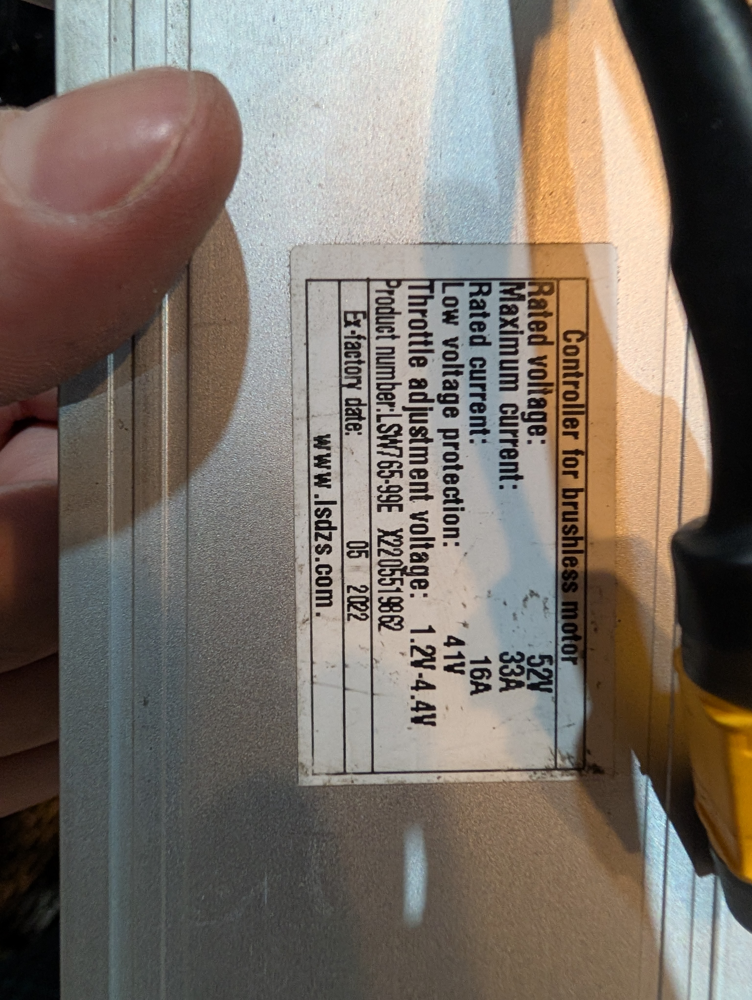
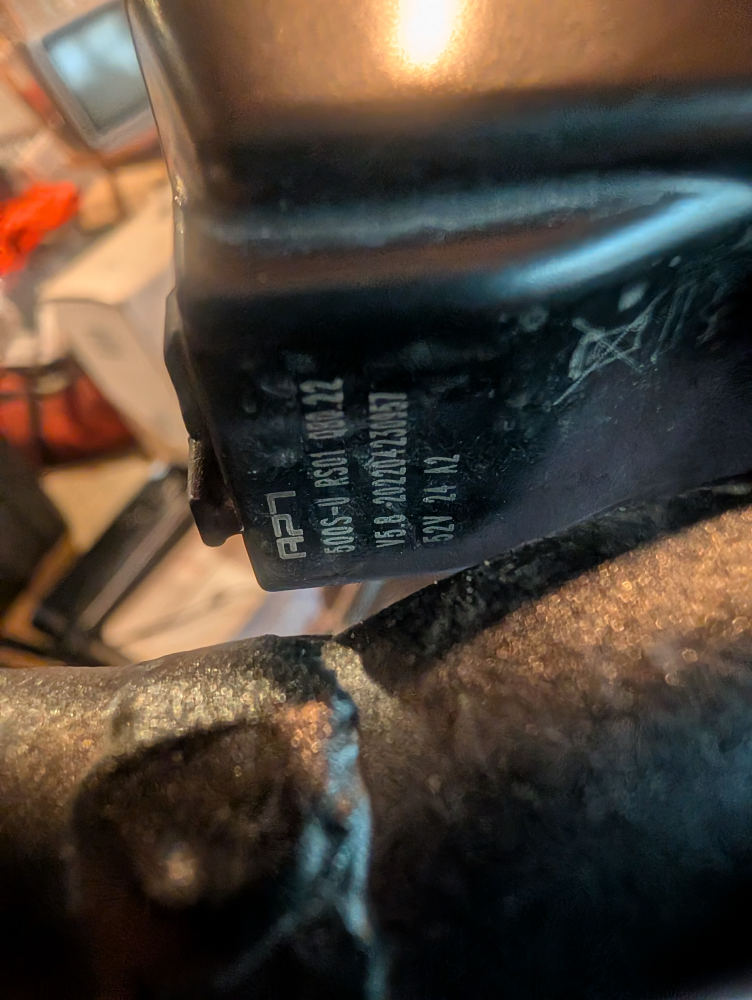

# ebike_ble_bridge

ESP-IDF firmware that **passively sniffs** the controller→display UART line on an
Ariel Rider X-Class and rebroadcasts the telemetry as BLE GATT notifications, plus a
native Android app that logs it in the background.

## Bike-specific facts

- Ariel Rider X-Class 52V (pre-2024), single Bafang 1000W rear hub motor
- Battery: 52V × 20Ah = **1040 Wh** pack
- Tires: CST 20" × 4.0" fat (wheel circumference assumed **1620 mm** — measure yours)
- Controller: **Lishui LSW7765-99E** (52V, 33A peak, 16A rated, 41V LVC, 05/2022)
- Display: **APT 500S-U**

## Hardware labels

| Controller | Display |
|---|---|
|  |  |

Controller (`lsdzs.com` = Lishui): **LSW7765-99E** — 52V, 33A max, 16A rated, 41V LVC,
mfg 05/2022. Display: **APT 500S-U**, firmware **V5.0**. The Lishui controller paired
with this APT display is what drives the protocol choice below.

## Protocol — important

The controller is a **Lishui** unit. Lishui controllers speak a **KM5S / KingMeter /
Kunteng-style display protocol at 9600 baud**, *not* Bafang UART at 1200. (A Bafang
600C display throws a `30H` comm error on the X-Class — proof the controller is not
native Bafang. The APT 500S ships in OEM-specific firmware variants and Ariel spec'd
the Lishui one.) The exact dialect is confirmed by the **first byte of each frame**:

| First byte | Dialect            | Frame             |
|-----------:|--------------------|-------------------|
| `0x41`     | Kunteng / KT-LCD3  | 12 bytes          |
| `0x46`     | KingMeter 618U     | 8 bytes           |
| `0x3A`     | KM5S / 901U        | variable, ends `0D 0A` |

UART is **9600 baud, 8N1**. If the raw dump is garbage at 9600, recompile at 1200
(covers the unlikely Bafang case): change `UART_BAUD` in `main/main.c`.

### What this tap can and cannot see

Tapping the single controller→display TX wire gives **real current, wheel speed,
error, brake, and motor temp**. It does **not** give:

- **Precise pack voltage.** These protocols send a coarse SOC/bar level plus a
  nominal-voltage byte. The `voltage` characteristic is therefore *approximate*; the
  **battery-SOC characteristic (`0xEB0D`) is the real gauge**. Power and Wh are
  approximate (nominal 52V × real current).
- **PAS level / throttle.** Those travel on the display→controller direction. To
  capture them, add a second tap from the display-TX wire into a second ESP32 UART
  (e.g. UART1 on another GPIO) — out of scope for v1; the characteristics exist but
  stay 0.

## Project layout

```
espBike/
├── CMakeLists.txt          # top-level ESP-IDF project
├── sdkconfig.defaults      # NimBLE on, Bluedroid off
├── main/
│   ├── CMakeLists.txt
│   └── main.c              # firmware: UART sniff + BLE GATT
├── test/decode_test.c      # host unit test for the decode math (gcc)
├── android/                # native Android app (see android/README.md)
└── docs/                   # hardware label photos
```

## Wiring (read-only passive sniff)

```
Controller TX  ──10kΩ──┬── GPIO16 (ESP32 UART2 RX)
                       │
                      20kΩ
                       │
Bike GND ──────────────┴──── ESP32 GND
```

The display UART data lines are commonly **~3.3 V logic** (Bafang-family lines were
measured at 0–3.6 V), in which case the divider is optional and you can wire
controller-TX straight to GPIO16. **Measure first** — if it's a true 5 V TTL line, use
the 10k/20k divider shown (ESP32 RX is not 5 V tolerant).

**Identify controller-TX on the spare Y-branch:** unplug the display, power the bike,
meter each pin — ~52 V = battery+ (tape it off, never to the ESP32), 0 V = GND, and
the signal pin showing a **pulsing ~2.5 V average** is controller-TX. The other signal
pin (0 V with display unplugged) is display-TX.

Power the ESP32 from USB during bench testing. For a permanent install use a buck
converter rated for ≥60 V input (52 V pack peaks ~58 V) → 5 V into ESP32 5V.
**Never connect the bike's 52 V line directly to the ESP32.**

## Build / flash / monitor

Requires **ESP-IDF v6.0**. Install via the ESP-IDF Installation Manager (EIM) or the
VS Code "Espressif IDF" extension.

```bash
. $HOME/esp/esp-idf/export.sh        # Windows: %USERPROFILE%\esp\esp-idf\export.ps1
idf.py set-target esp32              # or: idf.py set-target esp32c3
idf.py build
idf.py -p /dev/ttyUSB0 flash monitor # Windows: -p COMx
```

**Chip recommendation:** ESP32-C3 DevKitC — ~$3, BLE 5.0 radio, small enough to tuck
into the controller housing. The original ESP32 also works.

## Protocol bring-up (do this before trusting decoded values)

1. Flash the firmware (USB power, bench).
2. Power the bike so the display talks to the controller.
3. In **nRF Connect**, connect to `EBIKE-X-CLASS` and subscribe to `0xEB0A` (raw).
4. Short frames notify every ~100 ms. Read the **first byte**: `0x41`/`0x46`/`0x3A`
   confirms the dialect (and that 9600 is correct). Garbage ⇒ recompile at 1200.
5. Cross-check the decoded `current`/`speed`/`SOC` characteristics against the stock
   display while riding on a stand; adjust the byte offsets in `main/main.c` if the
   OEM variant differs from the documented maps.

## BLE characteristics

Service `0000eb1c-0000-1000-8000-00805f9b34fb`. All READ + NOTIFY.

| UUID    | Type       | Meaning            | Unit / notes                |
|---------|------------|--------------------|-----------------------------|
| 0xEB0A  | byte[≤64]  | Raw frame          | hex — confirm format here   |
| 0xEB01  | uint16     | Pack voltage       | mV — **approx (nominal)**   |
| 0xEB02  | int32      | Pack current       | mA (− = regen; int32: 33A > int16) |
| 0xEB03  | int16      | Power              | W — **approx**              |
| 0xEB04  | uint16     | Wheel speed        | mph × 100                   |
| 0xEB05  | uint8      | Cadence            | rpm (often unavailable)     |
| 0xEB06  | uint8      | PAS level          | 0–5 (needs display-TX tap)  |
| 0xEB07  | uint8      | Throttle           | % (needs display-TX tap)    |
| 0xEB08  | uint8      | Brake              | 0/1                         |
| 0xEB09  | uint8      | Error code         | controller raw              |
| 0xEB0B  | uint8      | Motor temperature  | °C (if thermistor present)  |
| 0xEB0C  | uint32     | Energy used        | mWh, cumulative — **approx**|
| 0xEB0D  | uint8      | Battery SOC        | raw bar level — **real gauge** |

The firmware advertises with a **stable public address** so the Android app can
associate/filter on it (CompanionDeviceManager does not support random addresses).

## Phone-side dashboard (Android)

Native Kotlin + Jetpack Compose, min SDK 33 / target 35. Background BLE while the
screen is off and music is playing is the hard requirement, so the architecture uses:

- **CompanionDeviceManager** — one-time association to this specific ESP32 (filter on
  the stable name/address). Avoids `ACCESS_FINE_LOCATION` and gives auto-reconnect
  when near the bike.
- **CompanionDeviceService** → starts a **foreground service of type
  `connectedDevice`** from `onDeviceAppeared()` that holds the GATT connection through
  Doze with a persistent notification. Permissions: `BLUETOOTH_CONNECT`,
  `BLUETOOTH_SCAN`, `FOREGROUND_SERVICE`, `FOREGROUND_SERVICE_CONNECTED_DEVICE`,
  `POST_NOTIFICATIONS`, `REQUEST_COMPANION_RUN_IN_BACKGROUND`.
- **Room** for ride logs, **StateFlow** for live UI, **MediaSession** so the lock
  screen shows watts/speed beside music.

The dashboard surfaces what we actually have: watts (approx), speed, **battery bars +
Wh used / 1040 Wh**, current, motor temp, error; a live 60 s watts graph; and an
end-of-ride summary. Voltage is shown as approximate/bars, not a precise number.

The full app lives under [`android/`](android/) and compiles to a debug APK
(`gradlew :app:assembleDebug`). See [android/README.md](android/README.md) for build
and setup details.

## Status

- **Firmware** — builds under ESP-IDF v6.0.1 (`-Werror`), boots in QEMU 9.2.2, decode
  math covered by host unit tests (`test/decode_test.c`).
- **Android app** — compiles and packages to a debug APK (compileSdk 35, minSdk 33).
- **Not yet done on real hardware** — confirm the protocol dialect by sniffing actual
  frames (char `0xEB0A`), then verify on-device BLE pairing/connection.
